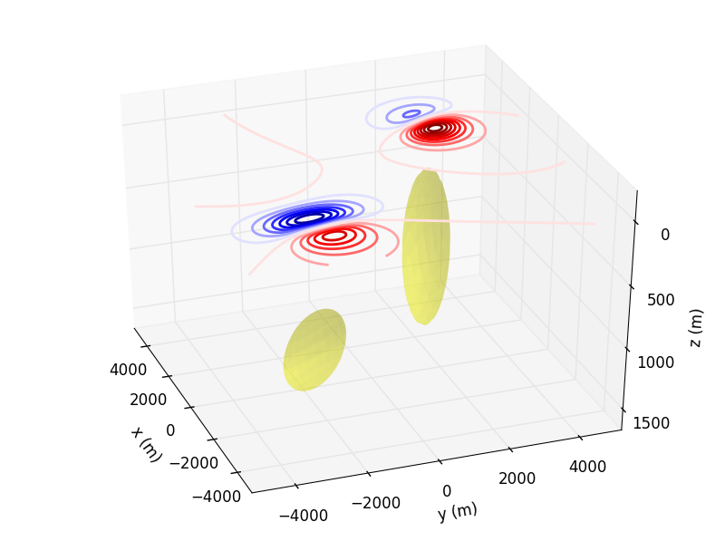
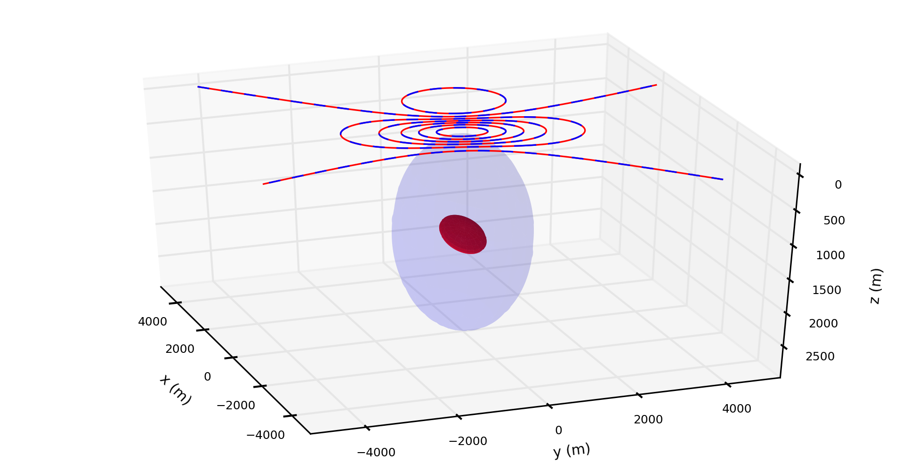

# Ellipsoids (v1.0): 3D magnetic modelling of ellipsoidal bodies

by
[Diego Takahashi](http://www.pinga-lab.org/people/tomazella.html)1 and
[Vanderlei C. Oliveira Jr.](http://www.pinga-lab.org/people/oliveira-jr.html)1

1[Observatório Nacional](http://www.on.br/index.php/pt-br/)

This paper has been submitted for publication in
[*Geoscientific Model Development (GMD)*](http://www.geoscientific-model-development.net/).

## Abstract

A considerable amount of literature has been published on the magnetic
modelling of uniformly magnetized ellipsoids since the second half of
the nineteenth century. Ellipsoids have flexibility to represent a wide
range of geometrical forms, are the only known bodies which can be
uniformly magnetized in the presence of a uniform inducing field and
are the only finite bodies for which the self-demagnetization can be treated
analytically. This property makes ellipsoids particularly useful for
modelling compact orebodies having high susceptibility. In this case,
neglecting the self-demagnetization may strongly mislead the interpretation
of these bodies by using magnetic methods. A number of previous studies
consider that the self-demagnetization can be neglected for the case in
which the geological body has an isotropic susceptibility lower than or
equal to 0.1 SI. This limiting value, however, seems to be determined
empirically and there has been no discussion about how this value was
determined. In addition, the geoscientific community lacks an easy-to-use
tool to simulate the magnetic field produced by uniformly magnetized
ellipsoids. Here, we present an integrated review of the magnetic
modelling of arbitrarily oriented triaxial, prolate and oblate
ellipsoids. Our review includes ellipsoids with both induced and
remanent magnetization, as well as with isotropic or anisotropic
susceptibility. We also discuss the ambiguity between confocal ellipsoids
with the same magnetic moment and propose a
way of determining the isotropic susceptibility above which the
self-demagnetization must be taken into consideration. Tests with
synthetic data validate our approach. Finally, we provide a set
of routines to model the magnetic field produced
by ellipsoids. The routines are written in Python language as
part of the [Fatiando a Terra](http://www.fatiando.org/), which is an open-source library
for modelling and inversion in geophysics.

**Figure 1:** *Total-field anomaly produced by two triaxial ellipsoids.
Red lines indicate high values and blue lines indicate low values.*

**Figure 2:** *Total-field anomalies produced by two confocal triaxial ellipsoids.
The solid red lines represent the total-field anomaly produced by the red ellipsoid.
The dashed blue lines represent the total-field anomaly produced by the blue ellipsoid.*

## Reproducing the results

You can download a copy of all the files in this repository by cloning the
[git](https://git-scm.com/) repository:

    git clone https://github.com/pinga-lab/magnetic-ellipsoid.git

All source code used to generate the results and figures in the paper are in
the `code` folder. The sources for the manuscript text and figures are in `manuscript`.
See the `README.md` files in each directory for a full description.

The calculations and figure generation are all run inside
[Jupyter notebooks](http://jupyter.org/).
You can view a static (non-executable) version of the notebooks in the
[nbviewer](https://nbviewer.jupyter.org/) webservice:

http://nbviewer.jupyter.org/github/pinga-lab/magnetic-ellipsoid

See sections below for instructions on executing the code.

### Setting up your environment

You'll need a working Python **2.7** environment with all the standard
scientific packages installed (numpy, scipy, matplotlib, etc).  The easiest
(and recommended) way to get this is to download and install the
[Anaconda Python distribution](http://continuum.io/downloads#all).
Make sure you get the **Python 2.7** version.

Use `conda` package manager (included in Anaconda) to create a
[virtual environment](https://conda.io/docs/using/envs.html) with
all the required packages installed.
Run the following command in this folder (where `environment.yml`
is located):

    conda env create

To activate the conda environment, run

    source activate ellipsoids

or, if you're on Windows,

    activate ellipsoids

This will enable the environment for your current terminal session.
After running the code, deactivate the environment with the following
commands:

    source deactivate

or, if you're on Windows,

    deactivate

**Windows users:** We recommend having a bash shell and the `make` installed
to run the code, produce the results and check the code. You may download the
[*Git for Windows*](https://git-for-windows.github.io/) and the
[*Software Carpentry Windows Installer*](https://github.com/swcarpentry/windows-installer/releases).

### Running the code

To execute the code in the Jupyter notebooks, you must first start the
notebook server by going into the repository folder and running:

    jupyter notebook

Make sure you have the `conda` environment enabled first.

This will start the server and open your default web browser to the Jupyter
interface. In the page, go into the `code` folder and select the
notebook that you wish to view/run.

The notebook is divided into cells (some have text while other have code).
Each cell can be executed using `Shift + Enter`.
Executing text cells does nothing while executing code cells runs the code
and produces it's output.
To execute the whole notebook, run all cells in order or use "Cell -> Run All"
from the menu bar.

### Archived version at [Zenodo](https://zenodo.org/)

You can also find an archived version of the code at:

## License

All source code is made available under a BSD 3-clause license.  You can freely
use and modify the code, without warranty, so long as you provide attribution
to the authors.  See `LICENSE.md` for the full license text.

The manuscript text is not open source. The authors reserve the rights to the
article content, which is currently submitted for publication in
[*Geoscientific Model Development (GMD)*](http://www.geoscientific-model-development.net/).
